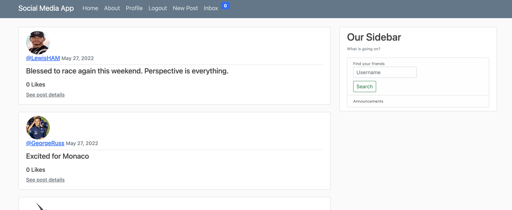
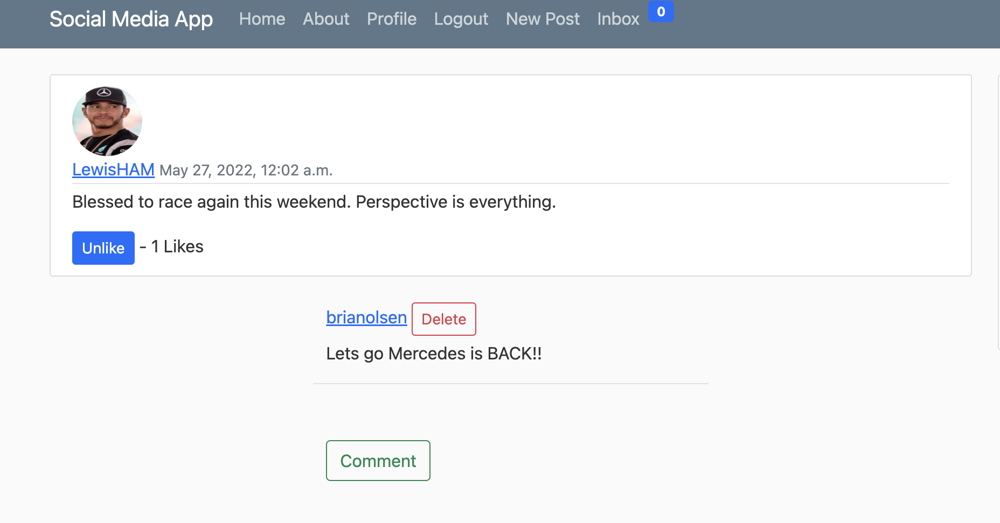

<div id="top"></div>

[![Contributors][contributors-shield]][contributors-url]
[![Forks][forks-shield]][forks-url]
[![Stargazers][stars-shield]][stars-url]
[![Issues][issues-shield]][issues-url]
[![LinkedIn][linkedin-shield]][linkedin-url]


<!-- PROJECT LOGO -->
<br />
<div align="center">
  <a href="https://github.com/btolsen131/ToDoList">
    
  </a>

<h3 align="center">Just Do It Already</h3>

  <p align="center">
    This project is a full stack CRUD app with user registration features.
    <br />
    <a href="https://github.com/btolsen131/ToDoList"><strong>Explore the docs »</strong></a>
    <br />
    <br />
    <a href="https://github.com/btolsen131/ToDoList">View Demo</a>
    ·
    <a href="https://github.com/btolsen131/ToDoList/issues">Report Bug</a>
    ·
    <a href="https://github.com/btolsen131/ToDoList/issues">Request Feature</a>
  </p>
</div>


<!-- TABLE OF CONTENTS -->
<details>
  <summary>Table of Contents</summary>
  <ol>
    <li>
      <a href="#about-the-project">About The Project</a>
      <ul>
        <li><a href="#built-with">Built With</a></li>
      </ul>
    </li>
    <li>
      <a href="#getting-started">Getting Started</a>
      <ul>
        <li><a href="#prerequisites">Prerequisites</a></li>
        <li><a href="#installation">Installation</a></li>
      </ul>
    </li>
    <li><a href="#usage">Usage</a></li>
    <li><a href="#contact">Contact</a></li>
  </ol>
</details>


<!-- ABOUT THE PROJECT -->
## About The Project


 `This full stack project uses Python and MySQL to build a web app to enter and track tasks to do. The app was built using the Flask Python framework. I used the SQLAlchemy, Bcrypt, and LoginManager libraries to build out the database connection and user authenication features.`

<p align="right">(<a href="#top">back to top</a>)</p>


### Built With

* [Python3](https://www.python.org/)
* [Bootstrap](https://getbootstrap.com)
* [MySQL](https://www.mysql.com/)

<p align="right">(<a href="#top">back to top</a>)</p>


<!-- GETTING STARTED -->
## Getting Started

To get this project to run on your local computer download the below packages. Once downloaded please enter your information here.
<br />
MySQL Database 

```app.config['SQLALCHEMY_DATABASE_URI] = #your database here```
<br />
Admin Email info 

```app.config['MAIL_USERNAME'] = #your admin email here```
``` app.config['MAIL_PASSWORD'] = #your admin email password here```

### Prerequisites

The below packages are required to be downloaded to run the app.
* Python
* Flask
* Flask-wtf
* itsdangerous
* Flask_login
* Flask_bcrypt
* Flask_mail
* Flask_sqlachemy
* MySQL


<!-- USAGE EXAMPLES -->
## Usage

<a href="https://github.com/btolsen131/ToDoList">
    
  </a> 
  
<a href="https://github.com/btolsen131/ToDoList">
    
  </a>


  
 

<p align="right">(<a href="#top">back to top</a>)</p>


<!-- CONTRIBUTING -->
## Contributing

If you have a suggestion that would make this better or for additional features, please fork the repo and create a pull request. You can also simply open an issue with the tag "enhancement".
Don't forget to give the project a star! Thanks again!

1. Fork the Project
2. Create your Feature Branch (`git checkout -b feature/AmazingFeature`)
3. Commit your Changes (`git commit -m 'Add some AmazingFeature'`)
4. Push to the Branch (`git push origin feature/AmazingFeature`)
5. Open a Pull Request

<p align="right">(<a href="#top">back to top</a>)</p>


<!-- CONTACT -->
## Contact

Brian Olsen - btolsen131@gmail.com

Portfolio Website: [https://btolsen131.github.io/portfolio_website/](https://btolsen131.github.io/portfolio_website/)

Project Link: [https://github.com/btolsen131/ToDoList](https://github.com/btolsen131/ToDoList)

LinkedIn: [https://www.linkedin.com/in/briantolsen/](https://www.linkedin.com/in/briantolsen/)

<p align="right">(<a href="#top">back to top</a>)</p>


<!-- MARKDOWN LINKS & IMAGES -->
<!-- https://www.markdownguide.org/basic-syntax/#reference-style-links -->
[contributors-shield]: https://img.shields.io/github/contributors/btolsen131/ToDoList.svg?style=for-the-badge
[contributors-url]: https://github.com/btolsen131/ToDoList/graphs/contributors
[forks-shield]: https://img.shields.io/github/forks/btolsen131/ToDoList.svg?style=for-the-badge
[forks-url]: https://github.com/btolsen131/ToDoList/network/members
[stars-shield]: https://img.shields.io/github/stars/btolsen131/ToDoList.svg?style=for-the-badge
[stars-url]: https://github.com/btolsen131/ToDoList/stargazers
[issues-shield]: https://img.shields.io/github/issues/btolsen131/ToDoList.svg?style=for-the-badge
[issues-url]: https://github.com/btolsen131/ToDoList/issues
[linkedin-shield]: https://img.shields.io/badge/-LinkedIn-black.svg?style=for-the-badge&logo=linkedin&colorB=555
[linkedin-url]: https://linkedin.com/in/briantolsen
